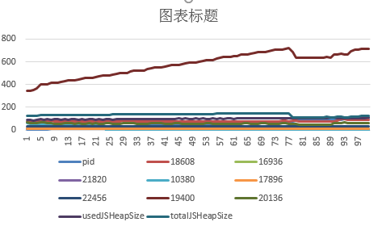

# 前端内存泄漏 - 威力加强版

# 背景

前端应用越来越复杂，反复操作可能导致dom或js对象没有被正确回收，导致内存占用持续高位。




## 测试原理

- Selenium 控制浏览器反复操作
- psutil 获取操作系统层面的内存占用
- window.performance.memory 获取浏览器V8引擎级别js堆内存使用情况（chrome only）
- openpyxl 记录到excel
- robotframework 包装降低学习成本


## 工程目录介绍

```
├─1-TestCase
│      切换.txt
│
├─2-DOMElement
│      commonVariable.txt
│      HomePage.txt
│
├─3-Keywords
│      CanvasAW.txt
│      Common.txt
│      CommonAction.txt
│      CommonAssert.txt
│      CommonDriver.txt
│      CommonResolve.txt
│      CommonWait.txt
│      HomePage.txt
│      MemLeak.txt
│      UplSolo.txt
│
├─5-Extendlibrary
│  │
│  └─MemoryLeak
│          MemoryUtils.py
│          MemUsageExcel.py
```


- UplSolo.txt：封装页面上的业务操作
- MemLeak.txt：封装跟内存泄漏有关的动作，MemUsageExcel.py 所有的方法在此划分
- MemUsageExcel.py：记录excel，调用MemoryUtils.py


## 曲折经历

### 进程号变化导致写excel数据不对齐

记录一开始的chrome进程，后续新增的进程不管，死掉的进程默认为0

### 精确内存需要在打开chrome时候新增参数


## 探讨

该方法是否真的能识别出内存泄漏？

1. 系统进程级别比js占用多很多
2. 系统进程级别的内存可能随应用当前页面展示的内容不同而（自动地）有所回落
3. 更进一步的分析就需要对数据进行分析了，后话了